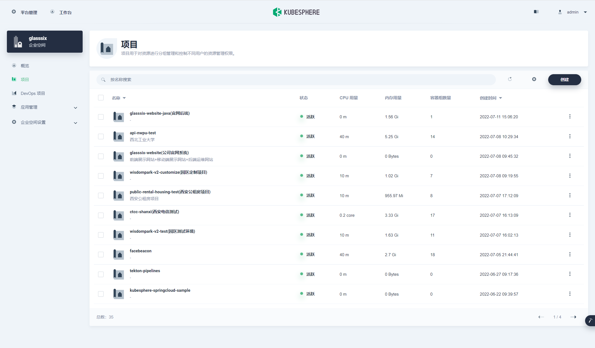
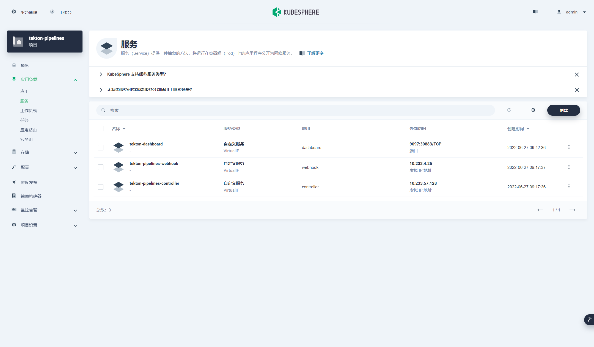
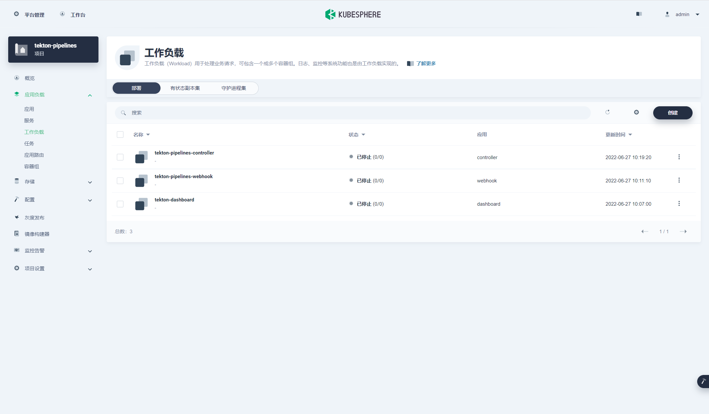
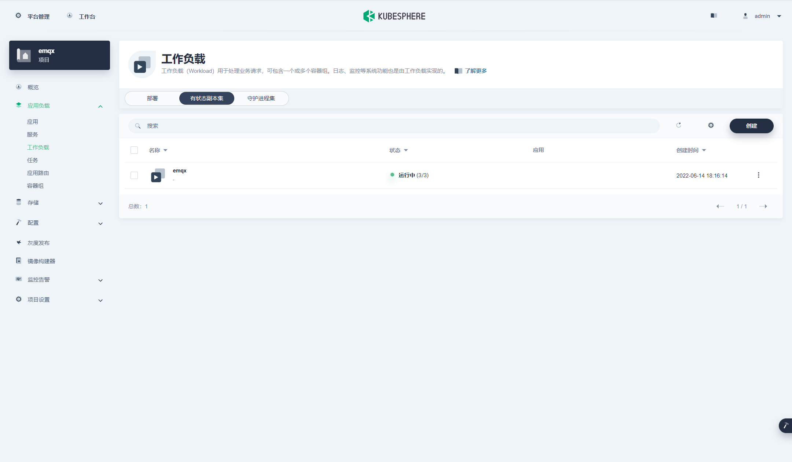
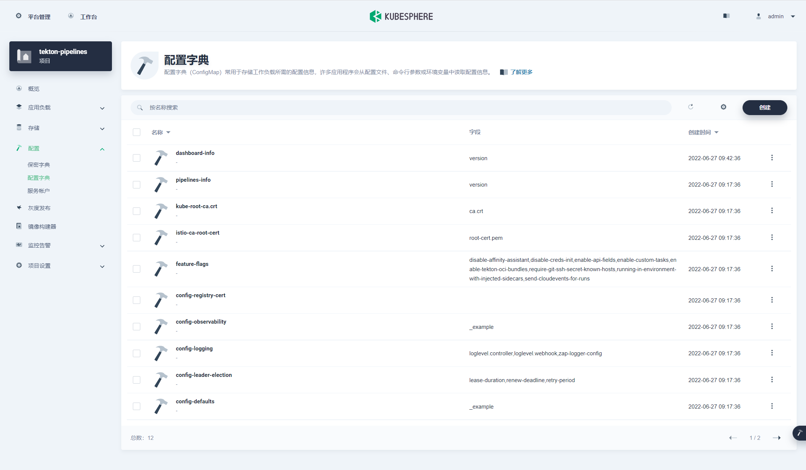
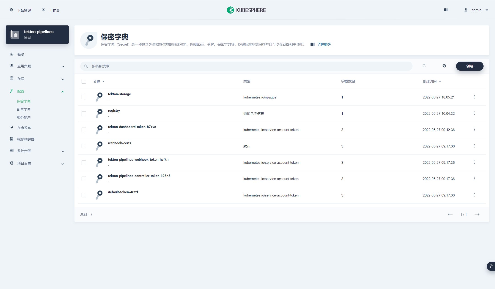

**1. 应用场景**

* 需要快速迭代的应用，可以通过k8s去控制应用状态，开发人员只需要将代码打包上传，然后k8s去拉取镜像并且更新应用状态，省略传统模式的部署步骤。  
* 项目多且架构庞大复杂，可通过k8s做应用的高可用管理。  
* 线上环境数量多，可以使用k8s部署应用以减少运维复杂度，降低因运维不当出现生产事故的概率。

**2. k8s功能**

> 服务发现和负载均衡  

* Kubernetes 可以使用 DNS 名称或自己的 IP 地址来曝露容器。 如果进入容器的流量很大， Kubernetes 可以负载均衡并分配网络流量，从而使部署稳定。

> 存储编排  

* Kubernetes 允许你自动挂载你选择的存储系统，例如本地存储、公共云提供商等。

> 自动部署和回滚  

* 你可以使用 Kubernetes 描述已部署容器的所需状态， 它可以以受控的速率将实际状态更改为期望状态。 例如，你可以自动化Kubernetes来为你的部署创建新容器， 删除现有容器并将它们的所有资源用于新容器。  

> 自动完成装箱计算  

* Kubernetes 允许你指定每个容器所需 CPU 和内存（RAM）。 当容器指定了资源请求时，Kubernetes 可以做出更好的决策来为容器分配资源。  

> 自修复  

* Kubernetes 将重新启动失败的容器、替换容器、杀死不响应用户定义的运行状况检查的容器，并且在准备好服务之前不将其通告给客户端。  

> 密钥与配置管理  

* Kubernetes 允许你存储和管理敏感信息，例如密码、OAuth 令牌和 ssh 密钥。 你可以在不重建容器镜像的情况下部署和更新密钥和应用程序配置，也无需在堆栈配置中暴露密钥。  

**3. k8s常用概念**

> namespace（名称空间）

> 名称空间提供一种机制，将同一集群中的资源划分为相互隔离的组。同一名称空间内的资源名称要唯一，但跨名称空间时没有这个要求。名称空间作用域仅针对带有名字空间的对象，例如 Deployment、Service等， 这种作用域对集群访问的对象不适用，例如 存储类型（StorageClass）、节点（Node）、持久卷（PersistentVolume）等  



> service（服务）

> service是k8s中的虚拟层，为我们的应用pod提供统一的访问入口，为应用提供服务发现功能。  
> 为什么k8s需要虚拟一层？



> deployment（部署）

> Deployment用于部署无状态副本集。  
> Deployment为Pod和ReplicaSet提供声明式的更新能力。  
> 你负责描述 Deployment 中的目标状态，而Deployment控制器（Controller）以受控速率更改实际状态，使其变为期望状态。你可以定义 Deployment 以创建新的 ReplicaSet。



> statefulset（有状态副本集）  

> 有状态和无状态应用类似，其中不同的是有状态应用会给每个pod维护一个固定的名称,并且能执行有序的、优雅的部署和扩缩和有序的、自动的滚动更新。



> configmap（配置字典）  

> 用来将非机密性的数据保存到键值对中。使用时， Pods 可以将其用作环境变量、命令行参数或者存储卷中的配置文件。  
> ConfigMap 将你的环境配置信息和 容器镜像 解耦，便于应用配置的修改。  
> 使用 ConfigMap 来将你的配置数据和应用程序代码分开。  
> 假设你正在开发一个应用，它可以在你自己的电脑上（用于开发）和在云上（用于实际流量）运行。你的代码里有一段是用于查看环境变量 DATABASE_HOST，在本地运行时，你将这个变量设置为 localhost ，在云上你将其设置为引用Kubernetes集群中的公开数据库组件的服务。 


 
> secret（保密字典）  

> Secret类似于ConfigMap但专门用于保存机密数据。
> Secret是一种包含少量敏感信息例如密码、令牌或密钥的对象。 这样的信息可能会被放在Pod规约中或者镜像中。 使用Secret意味着你不需要在应用程序代码中包含机密数据。  



**4. 案例部署**

以部署redis服务为例，配置文件使用configmap应用，密码使用secret引用，挂载持久卷。  

```yaml
kind: Service
apiVersion: v1
metadata:
  name: redis
  labels:
    app: redis
    version: v1
  annotations:
    kubesphere.io/creator: admin
    kubesphere.io/serviceType: statelessservice
spec:
  ports:
    - name: tcp-6379
      protocol: TCP
      port: 6379
      targetPort: 6379
  selector:
    app: redis
  type: NodePort
  sessionAffinity: None
  externalTrafficPolicy: Cluster
  ipFamilies:
    - IPv4
  ipFamilyPolicy: SingleStack
```
```yaml
kind: Deployment
apiVersion: apps/v1
metadata:
  name: redis-v1
  labels:
    app: redis
    version: v1
  annotations:
    deployment.kubernetes.io/revision: '2'
    kubesphere.io/creator: admin
spec:
  replicas: 1
  selector:
    matchLabels:
      app: redis
      version: v1
  template:
    metadata:
      creationTimestamp: null
      labels:
        app: redis
        version: v1
      annotations:
        logging.kubesphere.io/logsidecar-config: '{}'
    spec:
      volumes:
        - name: volume-hri1rp
          persistentVolumeClaim:
            claimName: redis-vol
      containers:
        - name: container-hny3sc
          image: 'redis:6-alpine'
          ports:
            - name: tcp-6379
              containerPort: 6379
              protocol: TCP
          env:
            - name: redis.conf
              valueFrom:
                configMapKeyRef:
                  name: redis-config
                  key: redis.conf
            - name: AUTH
              valueFrom:
                secretKeyRef:
                  name: redis
                  key: auth
          resources: {}
          volumeMounts:
            - name: volume-hri1rp
              mountPath: /data
          terminationMessagePath: /dev/termination-log
          terminationMessagePolicy: File
          imagePullPolicy: IfNotPresent
      restartPolicy: Always
      terminationGracePeriodSeconds: 30
      dnsPolicy: ClusterFirst
      serviceAccountName: default
      serviceAccount: default
      securityContext: {}
      schedulerName: default-scheduler
  strategy:
    type: RollingUpdate
    rollingUpdate:
      maxUnavailable: 25%
      maxSurge: 25%
  revisionHistoryLimit: 10
  progressDeadlineSeconds: 600

```
```yaml
kind: PersistentVolumeClaim
apiVersion: v1
metadata:
  name: redis-vol
  annotations:
    kubesphere.io/creator: admin
    pv.kubernetes.io/bind-completed: 'yes'
    pv.kubernetes.io/bound-by-controller: 'yes'
    volume.beta.kubernetes.io/storage-provisioner: openebs.io/local
    volume.kubernetes.io/selected-node: k8s-w1
  finalizers:
    - kubernetes.io/pvc-protection
spec:
  accessModes:
    - ReadWriteOnce
  resources:
    requests:
      storage: 10Gi
  storageClassName: local
  volumeMode: Filesystem
```
```yaml
kind: ConfigMap
apiVersion: v1
metadata:
  name: redis-config
  annotations:
    kubesphere.io/creator: admin
data:
  redis.conf: |-
    dir "/data"
    port 6379
    maxmemory 0
    maxmemory-policy volatile-lru
```
```yaml
kind: Secret
apiVersion: v1
metadata:
  name: redis
  annotations:
    kubesphere.io/creator: admin
data:
  auth: MTU5MjM0MjMK
type: Opaque

```
